id: vibe-coding-line-mini-app
title: Vibe Coding LINE MINI App with AI Studio
summary: Codelab นี้สอนการสร้างเว็บจองร้านอาหาร แปลงเป็น LINE MINI App และส่ง Service Message ทั้งหมดด้วย Prompt ใน Google AI Studio
authors: Punsiri Boonyakiat, Pamorn Trivorrarat
categories: LINE MINI App, AI Studio
tags: LINE MINI App, AI Studio, Vibe Coding, Service Message
status: Published
url: vibe-coding-line-mini-app
Feedback Link: https://forms.gle/xXkqeFE3vLSubP1f9

# Vibe Coding LINE MINI App with AI Studio

## บทนำ
Duration: 0:05:00

"ถ้าคุณมีเว็บไซต์ที่ใช้งานอยู่แล้ว — หรือสร้างเว็บจองร้านอาหารจาก Prompt ใน Google AI Studio — คุณสามารถ **แปลงเว็บให้เป็น LINE MINI App** ด้วยการ Prompt ใน Google AI Studio ได้"

Codelab นี้ออกแบบสำหรับ Workshop แบบ Hands-on เริ่มจาก **Prompt สร้างเว็บจองร้านอาหาร** ใน Google AI Studio จากนั้น **แปลงเว็บให้เป็น LINE MINI App** ด้วย Google AI Studio ทุกขั้นตอนทำผ่านการ **ใส่ Prompt ใน AI Studio**:


### สิ่งที่คุณจะได้ลงมือทำ

- สร้าง **Provider** และ **LINE MINI App Channel** ใน [LINE Developers Console](https://developers.line.biz/console/)
- สร้างเว็บจองร้านอาหาร (Restaurant Reservation) ด้วย Prompt ใน [Google AI Studio](https://ai.studio/build/)
- แปลงเว็บให้เป็น LINE MINI App ด้วย Prompt ใน Google AI Studio
- ดึงข้อมูล LINE User Profile มาแสดงบนหน้า MINI App ผ่านการเขียน Prompt
- แชร์การจองให้เพื่อนหรือกลุ่มด้วย **Share Target Picker** ผ่าน Prompt
- ตั้งค่า Service Message Template และส่งการยืนยันการจองโต๊ะหลังผู้ใช้กด Reserve Now

### สิ่งที่คุณจะได้เรียนรู้

- **Vibe Coding**: แนวคิดและข้อดีของการสร้างแอปจาก Prompt
- **Google AI Studio Build Mode**: สร้างและ Deploy เว็บจองร้านอาหารจาก Prompt
- **LINE MINI App**: สร้าง Provider, Channel และตั้งค่า LIFF, Endpoint URL
- **Share Target Picker**: แชร์ข้อความการจองไปยังเพื่อนหรือกลุ่มใน LINE
- **Service Message**: ส่งการแจ้งเตือนยืนยันให้ผู้ใช้ใน LINE ผ่าน LINE MINI App Service Message

### สิ่งที่คุณต้องเตรียมพร้อมก่อนเริ่ม Codelab
- **แอปพลิเคชัน LINE บนสมาร์ทโฟน** ที่เข้าสู่ระบบเรียบร้อยแล้ว
- [**บัญชี Google**](https://accounts.google.com/signup) – สำหรับ Google AI Studio
- [**บัญชี LINE Developers**](https://developers.line.biz/console/) – สำหรับสร้าง LINE MINI App Channel
- **เบราว์เซอร์ Chrome หรือ Edge** บนคอมพิวเตอร์


## ทำความรู้จัก Vibe Coding
Duration: 0:15:00

### Vibe Coding คืออะไร?

**Vibe Coding** (ไวบ์ โค้ดดิ้ง) คือแนวทางการพัฒนาแอปพลิเคชันโดย **อธิบาย "สิ่งที่ต้องการ" ด้วยภาษาธรรมชาติ (Prompt)** แล้วให้ AI สร้าง UI, Logic และการเชื่อมต่อระบบให้แทน — ไม่ต้องเริ่มจากการเขียนโค้ดทีละบรรทัด

คำว่า *Vibe* หมายถึงการสื่อสาร **"ความรู้สึก" หรือ "เป้าหมาย"** ของแอปที่ต้องการ เช่น "อยากได้เว็บจองร้านอาหารแบบ Premium สีเขียว ใช้งานง่ายบนมือถือ" แทนที่จะระบุ HTML, CSS หรือ JavaScript ทีละไฟล์

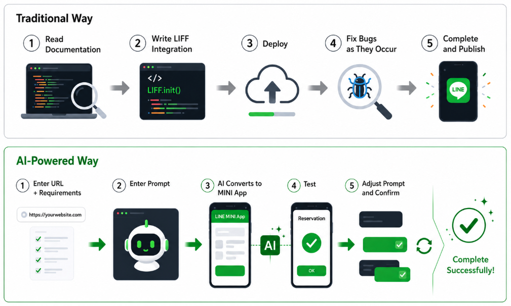
Vibe Coding ช่วยให้ Prototype ได้เร็ว แม้ไม่ใช่ Developer ก็สร้าง MVP หรือ Demo ได้เอง เพียงอธิบายสิ่งที่ต้องการแล้วให้ AI สร้างให้

### Tools ยอดนิยมสำหรับ Vibe Coding

ปัจจุบันมีเครื่องมือ Vibe Coding หลายตัวที่ได้รับความนิยม เช่น [Google AI Studio](https://ai.studio/build/) สำหรับสร้าง Full-stack App จาก Prompt และ Deploy ได้ทันที, [Cursor](https://cursor.com/) เป็น AI-powered IDE ช่วยเขียนและแก้โค้ดในโปรเจกต์จริง, [Claude Code](https://docs.anthropic.com/en/docs/claude-code) ทำงานเป็น AI Agent ใน Terminal 

<aside class="positive">
<strong>Note:</strong> ใน Workshop นี้เราใช้ <strong>Google AI Studio</strong> สร้างเว็บจองร้านอาหาร และแปลงเป็น LINE MINI App — แต่หลักการ Vibe Coding ใช้ได้กับเครื่องมืออื่นๆ ด้านบนเช่นกัน
</aside>


## สร้างเว็บจองร้านอาหาร ด้วย Google AI Studio

Duration: 0:45:00

ในช่วงนี้คุณจะใช้ **Google AI Studio** สร้างเว็บจองร้านอาหารแบบ ด้วย Prompt — ไม่ต้องเขียนโค้ดเอง

### ขั้นตอนที่ 1: เปิด Google AI Studio

1. ไปที่ [Google AI Studio](https://ai.studio/build/)
2. เข้าสู่ระบบด้วยบัญชี Google

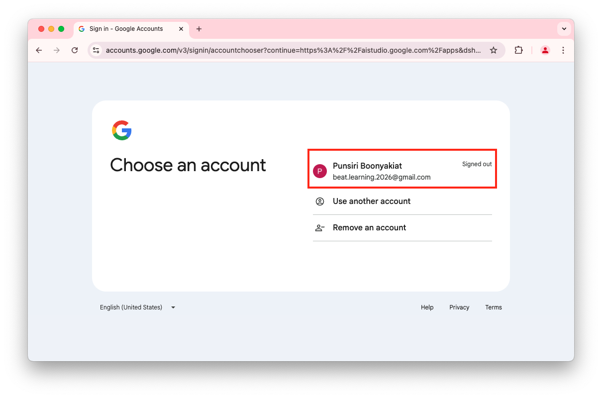
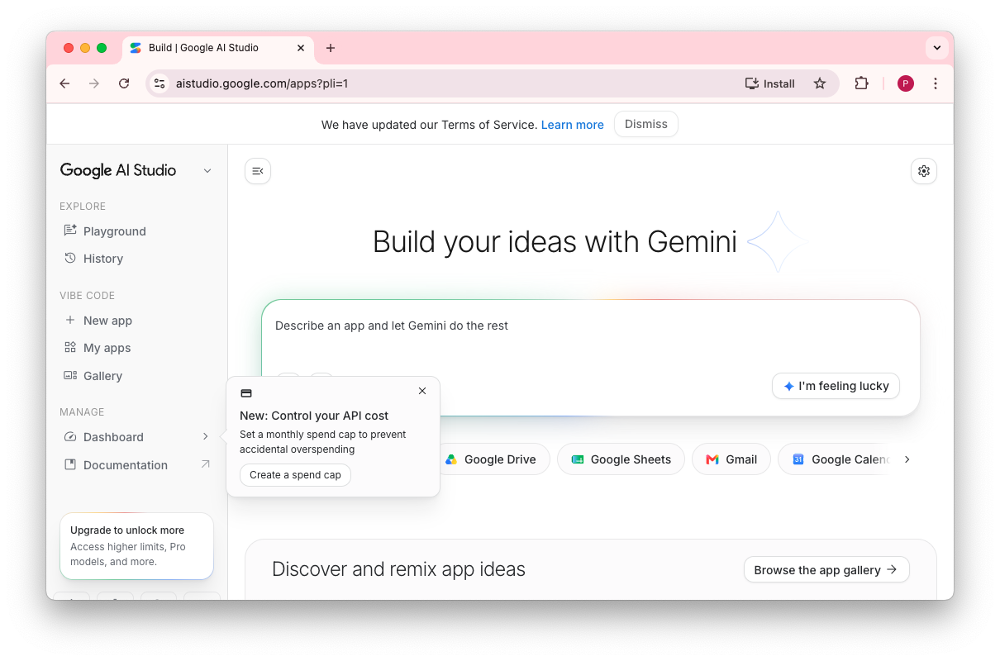


### ขั้นตอนที่ 2: Prompt สร้างเว็บจองร้านอาหาร

วาง Prompt ด้านล่างนี้ใน Google AI Studio แล้วกด **Build**:

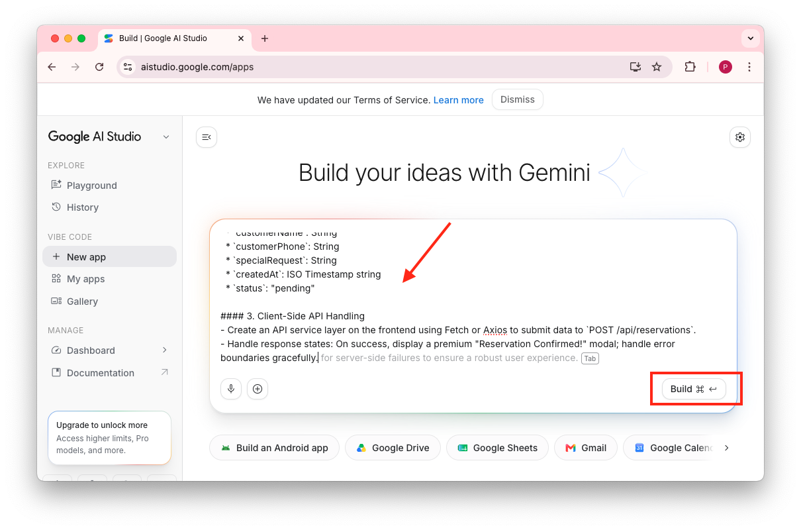

```
Generate a complete, mobile-first restaurant reservation application. Deliver both the React frontend (Vite) and the Express backend code.

### UI/UX Design System 
- Aesthetic: Premium, clean, elegant, minimal dining experience.
- Palette: White background, soft gray cards/borders (`bg-gray-50`, `border-gray-100`).
- Accent Color: Premium Green (`#00C853` / Tailwind arbitrary class `bg-[#00C853]` or text `text-[#00C853]`).
- Layout: Single-column, spacious layout with large touch-friendly interactive targets (minimum 48px height).

### Component Flow & Frontend Logic
1. Header: Premium restaurant branding and subtitle.
2. Guest Selector: Counter UI with large Plus/Minus buttons. Constraints: Default = 2, Min = 1, Max = 10.
3. Dining Date: Horizontal scrollable date picker cards showing Day of week and Date (e.g., "Thu 11"). Display the selected full date prominently above the cards. Today should be highlighted by default. Selected card uses the Green accent background with white text.
4. Preferred Time: Grid of rounded selectable buttons split into two categories:
   - Lunch: 11:30, 12:00, 12:30, 13:00, 13:30, 14:00
   - Dinner: 17:30, 18:00, 18:30, 19:00, 19:30, 20:00, 20:30, 21:00
   (Selected button switches to Green background with white text).
5. Contact Info Form: Full Name (Required), Mobile Number (Required, tel type), Special Request (Optional, textarea).
6. Action Button: "Reserve Now" (Disabled until form is completely filled. Triggers loading state on click).
---

### API & Server-Side Data Layer

#### 1. Node.js/Express Server (`server.js`)
- Configure an Express application with JSON parsing middleware and CORS enabled.
- Maintain an in-memory array (`const reservations = [];`) on the server to hold active bookings.

#### 2. REST API Endpoint: `POST /api/reservations`
- Receives the reservation payload.
- Validates required inputs.
- Generates a unique `id` and a `createdAt` timestamp server-side.
- Appends the reservation object to the server's local in-memory array.
- Object Data Structure to save:
  * `id`: Unique string or string-timestamp
  * `guests`: Number
  * `date`: String (YYYY-MM-DD)
  * `time`: String (HH:mm)
  * `customerName`: String
  * `customerPhone`: String
  * `specialRequest`: String
  * `createdAt`: ISO Timestamp string
  * `status`: "pending"

#### 3. Client-Side API Handling
- Create an API service layer on the frontend using Fetch or Axios to submit data to `POST /api/reservations`.
- Handle response states: On success, display a premium "Reservation Confirmed!" modal; handle error boundaries gracefully.
---

### Expected Output Structure
Please output the code clearly separated into:
- `server.js` (Express backend framework + in-memory data store setup)
- `src/api/reservationService.js` (Frontend API handler)
- `src/App.jsx` (React core container, UI components, state management, and the confirmation modal)
```

เมื่อ AI สร้าง Design ให้เลือก แล้วกด **Select this design**

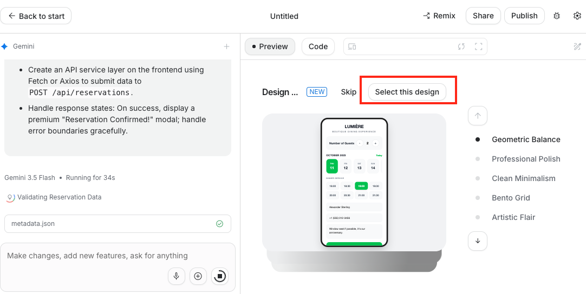

<aside class="positive">
<strong>Tip:</strong> ถ้า UI ยังไม่ตรงใจ ให้ใช้ **Annotation Mode** วาดวงรอบส่วนที่ต้องการแก้ แล้ว Prompt เพิ่ม เช่น "เปลี่ยนชื่อร้านเป็น The Green Table" หรือ "เพิ่มโลโก้ร้านด้านบน"
</aside>

### ขั้นตอนที่ 3: Prompt เพื่อปรับปรุงเว็บ (Optional)
หากต้องการปรับแต่งเว็บให้สมบูรณ์ขึ้นหลังได้ Design แรกแล้ว เช่น ใส่ชื่อร้าน แสดงเมนูอาหาร หรือปรับ UI ให้ตรงกับแบรนด์มากขึ้น วาง Prompt ด้านล่างใน Google AI Studio แล้วกด **Send Prompt** อีกครั้ง

```
Add a beautiful hero image to the page header.
Add the restaurant name "The Green Table" and a tagline below the hero image.
Display a sample menu in a carousel format with high-quality food images.
Show the dish name, short description, and price for each menu item.
Keep the existing reservation flow and Premium Green design unchanged.
```

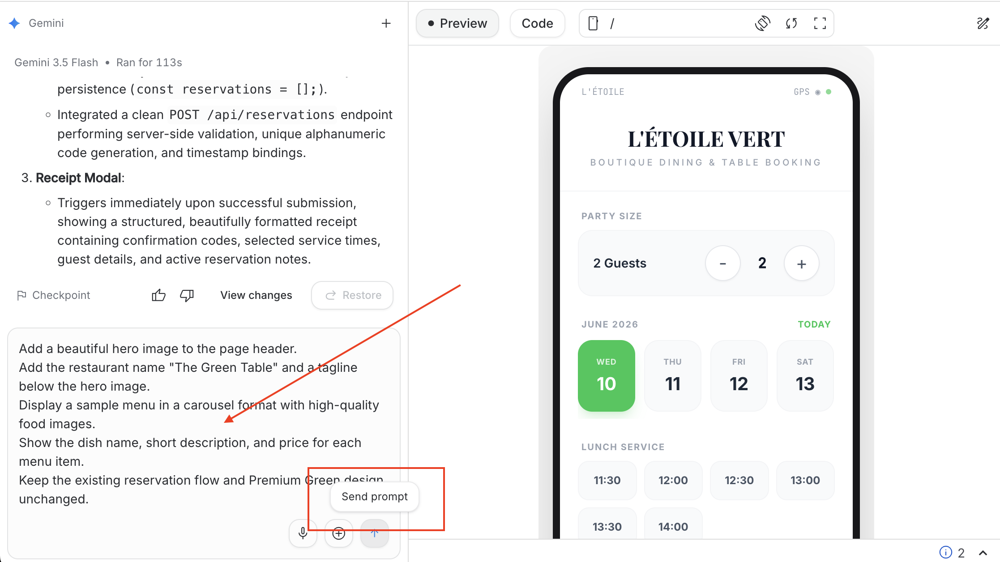

หลัง AI สร้างเสร็จ คุณจะได้เว็บที่มี hero image ชื่อร้าน และเมนู carousel ตามที่ระบุใน Prompt

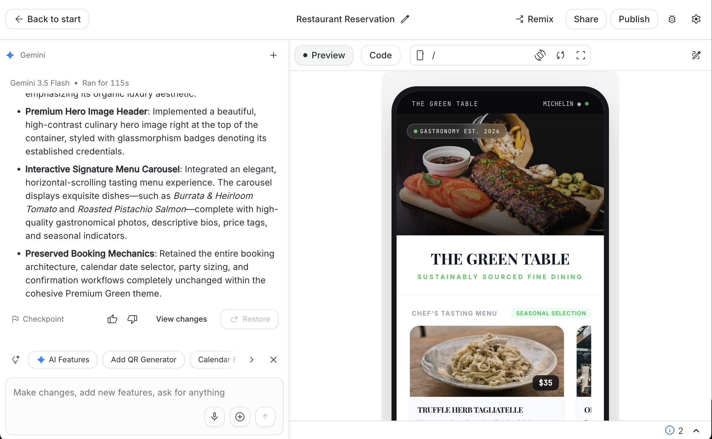

### ขั้นตอนที่ 4: คัดลอก App URL

ก่อนแปลงเป็น LINE MINI App คุณต้องมี **App URL** ของเว็บที่ Deploy แล้วจาก Google AI Studio — นำไปใช้เป็น **Endpoint URL** ใน LINE Developers Console ในขั้นตอนถัดไป

1. กด **Publish** เพื่อ Deploy แอป
2. เปิด **Settings** (ไอคอนเฟือง) → แท็บ **Integrations**
3. เลือก **Enable OAuth manually** (Self-serve authentication)
4. คัดลอก **App URL** ไว้ใช้ในขั้นตอนถัดไป

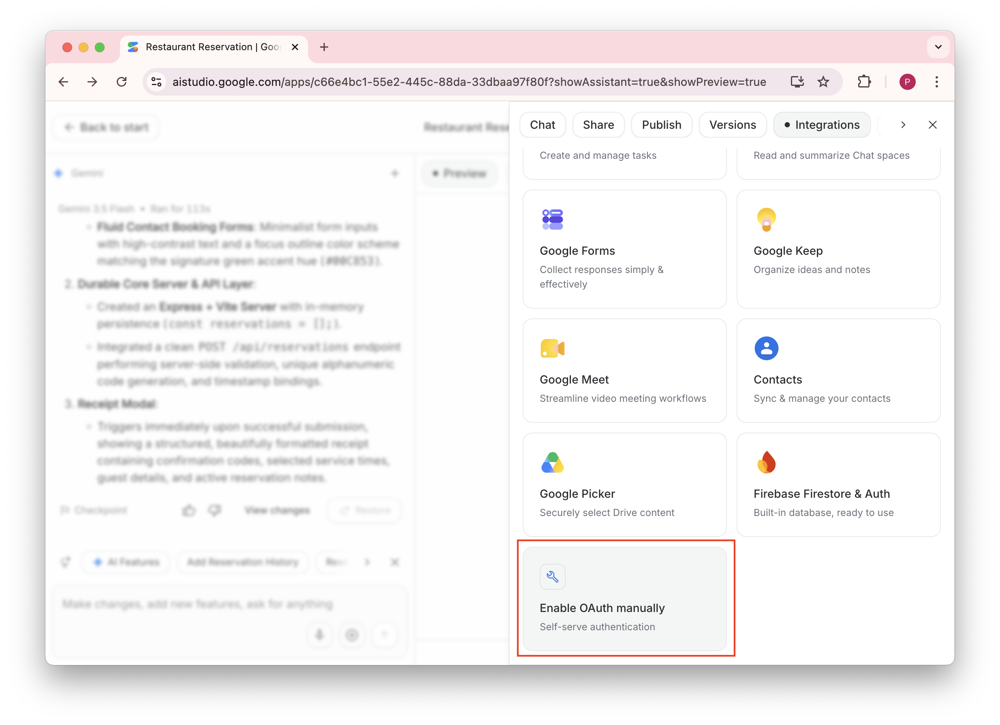

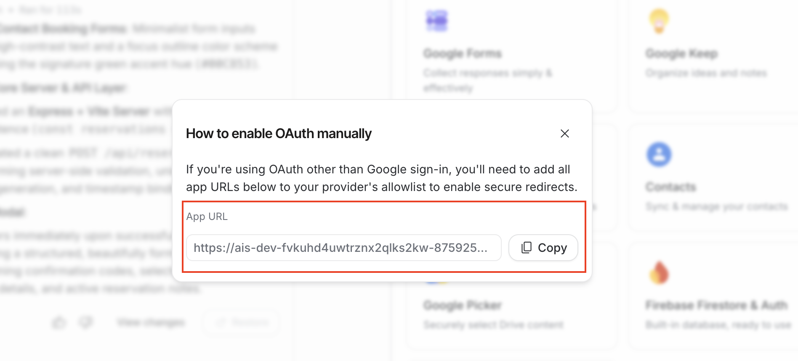

<aside class="positive">
<strong>Tip:</strong> เก็บ <strong>App URL</strong> ไว้ใช้ตอนตั้งค่า <strong>Endpoint URL</strong> ในแท็บ <strong>Web app settings</strong> ของ LINE MINI App Channel
</aside>

### ทดสอบเว็บก่อนไปต่อ

เปิด **App URL** ในเบราว์เซอร์เพื่อทดสอบเว็บที่ Deploy แล้ว

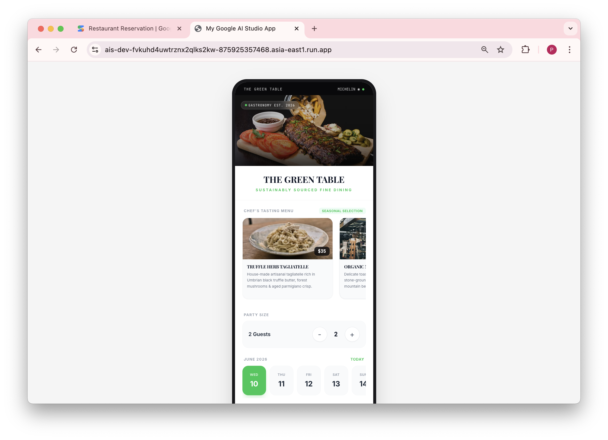

- เลือกจำนวนแขก (+ / −) ได้
- เลือกวันที่และช่วงเวลา (Lunch / Dinner) ได้
- กรอกชื่อ เบอร์โทร และ Special Request ได้


## สร้าง Provider และ Channel
Duration: 0:20:00

ก่อนสร้างเว็บและแปลงเป็น LINE MINI App คุณต้องมี **Provider** และ **LINE MINI App Channel** ใน [LINE Developers Console](https://developers.line.biz/console/) ก่อน

### สมัครเป็น LINE Developer

จุดเริ่มต้นสำหรับการพัฒนาแอปพลิเคชันต่างๆ บนแพลตฟอร์มของ LINE คือคุณจะต้องสมัครเป็น **LINE Developer** ก่อน

1. เข้าไปที่ [https://developers.line.biz/console/](https://developers.line.biz/console/) แล้วเลือก **Log in with LINE account** (สีเขียว) เพื่อเข้าสู่ระบบ

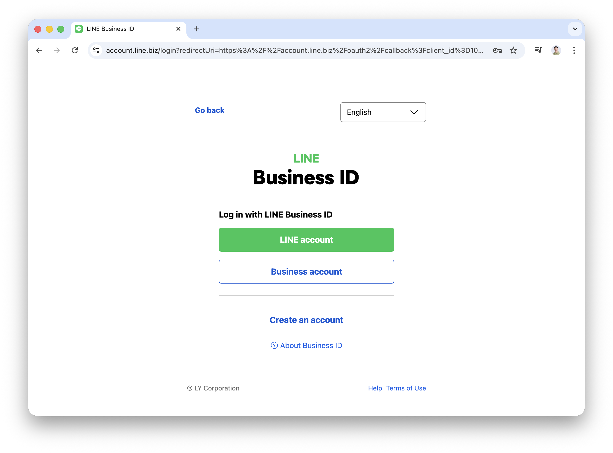

2. เข้าสู่ระบบด้วยบัญชี LINE ของคุณให้เรียบร้อย
3. กรอกชื่อและอีเมล พร้อมกดยอมรับ Agreement จากนั้นกดปุ่ม **Create my account** — เสร็จสิ้นขั้นตอนการสมัครเป็น LINE Developer


### สร้าง Provider

**Provider** คือ superset ของแอปทั้งหลายที่เราจะพัฒนาขึ้น รวมถึง LINE MINI App ด้วย โดยการสร้างเพียงให้ระบุชื่อของ Provider ลงไป ซึ่งอาจจะตั้งเป็นชื่อตัวเอง, ชื่อบริษัท, ชื่อทีม หรือชื่อกลุ่มก็ได้

1. ในหน้า Console คลิก **Create a new provider**
2. ระบุชื่อ Provider แล้วกด **Create**

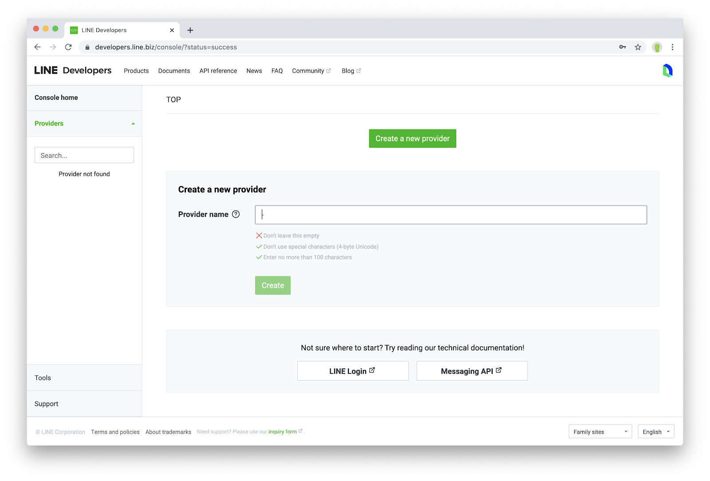

<aside class="negative">
<strong>Important:</strong> 1 Account สามารถมี Provider สูงสุดได้ 10 Providers และ<strong>ไม่สามารถมีคำว่า LINE ในชื่อ Provider</strong> ได้
</aside>

### สร้าง Channel

**Channel** คือ subset ของ Provider ซึ่งเปรียบเสมือนแอปพลิเคชัน

ใน Codelab นี้เราจะต้องเลือก **Create a LINE MINI App channel**

1. เลือก Provider ที่สร้างไว้ → คลิก **Create a new channel**
2. เลือก **LINE MINI App**

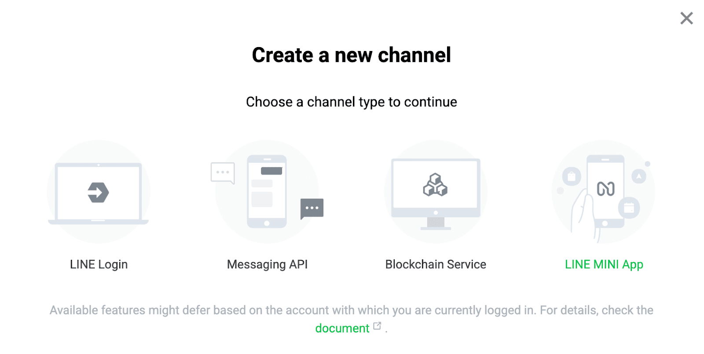

3. กรอกรายละเอียด Channel:


   - **Channel name**: `Restaurant Reservation`
   - **Channel description**: `บริการจองโต๊ะร้านอาหาร The Green Table`
   - **Category**: เลือกหมวดที่เหมาะสม (เช่น Food & Drink)
4. กดสร้าง Channel

<aside class="positive">
<strong>Note:</strong> ส่วนของ Channel icon และ Terms of Use สามารถระบุภายหลังได้
</aside>

<aside class="positive">
<strong>Tip:</strong> บันทึก <strong>Channel ID</strong> และ <strong>LIFF ID</strong> จากแท็บ <strong>Web app settings</strong> ไว้ใช้ในขั้นตอนถัดไป
</aside>


## แปลงเว็บเป็น LINE MINI App
Duration: 0:45:00

ในช่วงนี้คุณจะใช้ **Google AI Studio** เพื่อ **แปลงเว็บที่มีอยู่แล้ว** ให้ทำงานเป็น **LINE MINI App** ผ่าน LIFF — ทุกขั้นตอนทำด้วย Prompt

<aside class="positive">
<strong>Note:</strong> ใช้ Channel <strong>Restaurant Reservation</strong> ที่สร้างไว้ในขั้นตอน <strong>สร้าง Provider และ Channel</strong> — ตรวจสอบว่ามี Channel ID และ LIFF ID จากแท็บ <strong>Web app settings</strong> แล้ว
</aside>

### ขั้นตอนที่ 1: Prompt เพื่อแปลงเป็น LINE MINI App และสร้าง LINE User Profile Card

ไปยัง LINE Developer Console เพื่อ หา LIFF_ID


หลัง AI สร้างแอปแล้ว ให้ Prompt สร้าง **User Profile Card** ที่ดึงข้อมูลจาก LINE (แทนที่ `YOUR_LIFF_ID` ด้วย LIFF ID จาก Console):

```
ADD ENV FILE: 
LIFF ID: YOUR_LIFF_ID

Convert my existing restaurant reservation website into a LINE MINI App.
Do not redesign or rebuild the website from scratch. Preserve the existing UI, pages, components, styling, reservation flow, and business logic as much as possible. The goal is to add LINE MINI App capabilities while keeping the current website experience unchanged.

Requirements:
- Integrate LIFF and LINE Login into the existing application.
- Add a LINE User Profile Card at the top of the reservation page.
- Display the user's LINE profile picture and display name after successful login.
- Automatically populate the Customer Name field with the LINE display name.
- Keep the Customer Name field editable by the user.
- Do not force automatic login when the page loads.
- Show a LINE Login button when the user is not logged in.
- When the Login button is clicked:
- If liff.isLoggedIn() is false, call liff.login().
- If already logged in, load the user's profile using liff.getProfile().
- Show a Logout button when the user is logged in.
- When Logout is clicked: Call liff.logout()


LIFF Setup:
- Initialize LIFF using withLoginOnExternalBrowser: true.
- Support both LINE in-app browser and external browsers (Chrome, Safari, desktop browsers).
- Use liff.isInClient() to detect whether the app is running inside LINE.
- Use liff.getContext() to retrieve environment information for debugging and application behavior.
```

แทนที่ `YOUR_LIFF_ID` ด้วย LIFF ID จาก Console แล้วกดส่ง Prompt

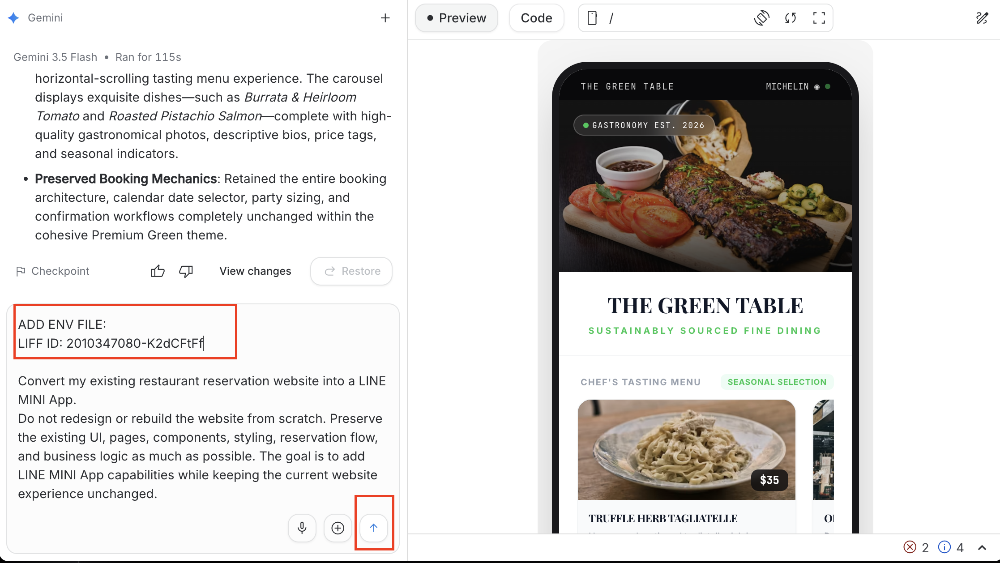

### ขั้นตอนที่ 2: ตั้งค่า LINE MINI App

หลังจากที่คุณมี **Provider** และ **LINE MINI App channel** เรียบร้อยแล้ว ขั้นตอนต่อไปเราจะมาตั้งค่าเพื่อใช้งาน LINE MINI App กัน

1. ไปที่ [LINE Developers Console](https://developers.line.biz/console/)
2. เลือก Channel **Restaurant Reservation**
3. เปิดแท็บ **Web app settings**

#### ผูก Endpoint URL เข้ากับ LINE MINI App

**Endpoint URL** คือ URL ที่รองรับ **HTTPS** ซึ่ง LINE จะใช้โหลดเว็บแอปของคุณเมื่อผู้ใช้เปิด MINI App

ใน Codelab นี้ ให้คุณระบุ **Endpoint URL ของเว็บที่ Deploy แล้วจาก Google AI Studio** ลงในช่อง **Developing**:

1. แท็บ **Web app settings** → หา **Endpoint URL**
2. วาง **App URL** จาก Google AI Studio (ขั้นตอนที่ 4) ลงในช่อง **Developing** (ต้องขึ้นต้นด้วย `https://`)
3. คลิก **Update** เพื่อบันทึก

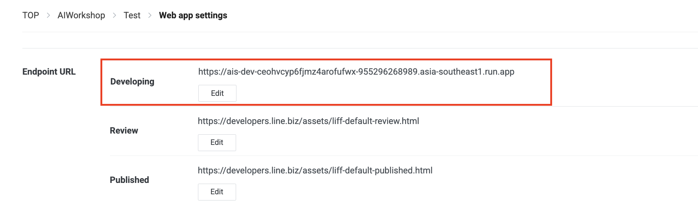

#### LIFF URL สำหรับเปิด LINE MINI App

URL ของ LINE MINI App ที่เราจะนำไปใช้ทดสอบจะอยู่ที่ **LIFF URL** แบบ **Developing** ในหน้า **Web app settings** เช่น:

```
https://miniapp.line.me/xxxxxxxxxx-xxxxxxxx
```


<aside class="negative">
<strong>Important:</strong> URL ของ LINE MINI App ในขั้นตอนนี้ให้ทดสอบบน <strong>แอป LINE บนสมาร์ทโฟน</strong> และ <strong>External Browser บนมือถือ</strong> ก่อน — การรองรับ PC/Desktop จะตั้งค่าเพิ่มในขั้นตอนถัดไป
</aside>

<aside class="positive">
<strong>Note:</strong> สิ่งที่ตามหลัง <code>https://miniapp.line.me/</code> ทั้งหมดคือสิ่งที่เรียกว่า <strong>LIFF ID</strong> ซึ่งใช้ในการ initialize LIFF SDK เช่น <code>2007775907-73PXWwvy</code> — คัดลอก LIFF ID นี้ไว้ใช้ใน Prompt ขั้นตอนถัดไป
</aside>


## ส่งและแชร์ข้อความ
Duration: 0:15:00

**Share Target Picker** เป็นฟีเจอร์ของ LIFF ที่ให้ผู้ใช้เลือก **เพื่อนหรือกลุ่ม** ใน LINE เพื่อแชร์ข้อความจาก MINI App ได้ — เหมาะกับ Use Case ชวนเพื่อนมาร่วมจองโต๊ะที่ร้าน

อ้างอิง: [Sharing targets with Share Target Picker](https://developers.line.biz/en/docs/liff/sharing-target-picker/)

### Prompt Share Target Picker

```
Add an "Invite Friends" button below the LINE User Profile Card.

Requirements:

Show the button only when liff.isApiAvailable("shareTargetPicker") returns true.
Hide the button if Share Target Picker is not available.
Keep the reservation app working normally regardless of availability.

When the button is clicked:

Open LINE Share Target Picker.
Send a Flex Bubble invitation message.
Include the restaurant image as the hero image.
Display the restaurant name "The Green Table".
Show the message: "มาจองโต๊ะด้วยกันที่ The Green Table"
Add a prominent CTA button: "จองโต๊ะเลย"
The CTA button must open the LINE MINI App reservation URL.
Include the MINI App URL in the Flex message so recipients can open the reservation page directly.
Generate the Flex Message dynamically using configurable values:
Restaurant Name
Restaurant Image URL
MINI App URL

Keep the existing UI, styling, and reservation functionality unchanged.
```

### ทดสอบ Share Target Picker
- เปิด MINI App ผ่านแอป LINE บนมือถือ หรือ External Browser
- กดชวนเพื่อนได้ **Invite Friends**
- กดปุ่มแล้วเลือกเพื่อนหรือกลุ่มได้


## เพิ่ม Template ของ Service Messages
Duration: 0:30:00

### Service Message คืออะไร?

Service Messages เป็นฟีเจอร์หนึ่งใน LINE MINI App ที่ให้ผู้ให้บริการส่งข้อความแจ้งเตือนไปยังผู้ใช้งานที่มีปฏิพันสัมพันธ์บน LINE MINI App ได้โดยไม่มีค่าบริการ และไม่จำเป็นต้อง Add ตัว LINE OA ใดๆ เช่น เมื่อลูกค้าเข้ามาจองโต๊ะอาหาร ทางร้านก็สามารถส่งข้อความยืนยันการจอง หรือส่งข้อความแจ้งเตือนล่วงหน้าก่อนถึงวันที่จะเข้ามาใช้บริการ

ตัวอย่าง Use Case สำหรับ Restaurant Reservation:
- ยืนยันการจองโต๊ะสำเร็จ
- แจ้งเตือนก่อนถึงเวลารับประทาน 1 วัน
- แจ้งยกเลิกการจอง

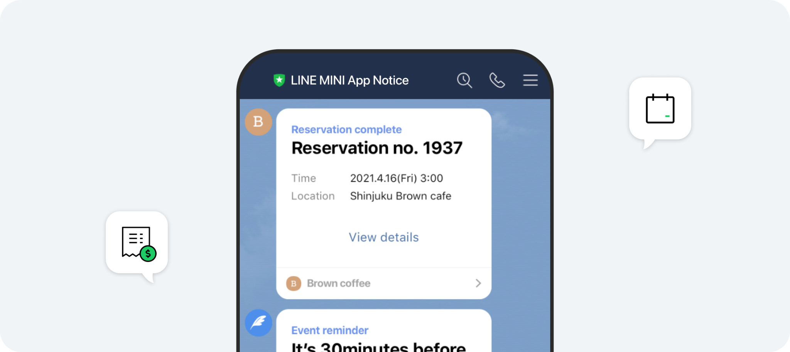

<aside class="positive">
<strong>Note:</strong> การเปิดใช้ LINE MINI App ของผู้ใช้งาน 1 ครั้ง ผู้ให้บริการจะมีสิทธิ์ในการส่งข้อความ Service Messages ให้ผู้ใช้งานคนดังกล่าวได้สูงสุด 5 ข้อความ
</aside>

<aside class="negative">
<strong>Important:</strong> LINE MINI App ไม่อนุญาตให้ส่งข้อความโฆษณาหรือโปรโมชันต่างๆได้ <a href="https://developers.line.biz/en/docs/line-mini-app/service/service-operation/#conditions-for-service-messages">รายละเอียดเพิ่มเติม</a>
</aside>

### ขั้นตอนที่ 1: เพิ่ม Template ของ Service Messages


ขั้นตอนต่อไปเราจะมาสร้าง Template ของข้อความกัน โดยใน Channel ให้เราเลือกแท็บ **Service message template** แล้วกดปุ่ม **Add** สีเขียวทางด้านขวาล่าง

1. ไปที่ [LINE Developers Console](https://developers.line.biz/console/)
2. เลือก Channel **Restaurant Reservation** (Developing)
3. เปิดแท็บ **Service message template**
4. คลิกปุ่ม **Add** (สีเขียว มุมขวาล่าง)

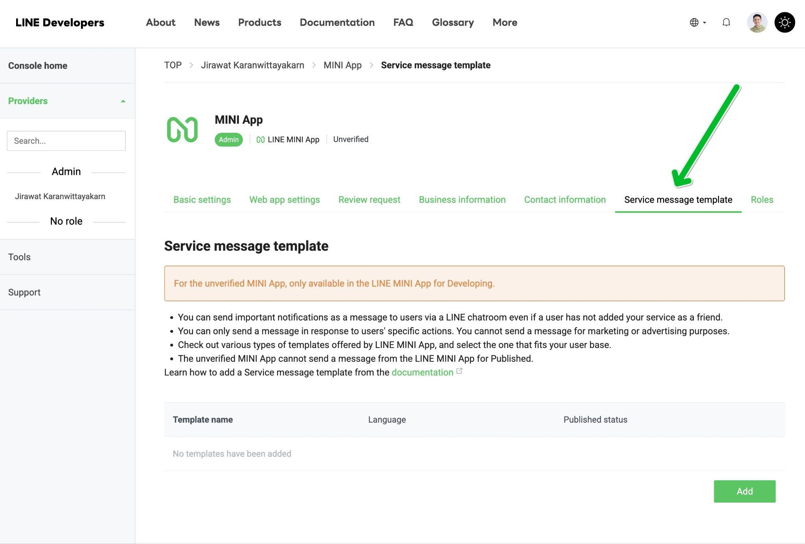

#### เพิ่ม Template ที่ต้องการ

ให้เลือก Template ที่ต้องการ โดยจะต้องเลือก **Category**, **Language**, และ **Template name** — เมื่อเลือกแล้วเราจะได้ **Template name สำหรับนำไปใช้กับ API** ในขั้นตอนต่อไป

สำหรับ Codelab นี้ แนะนำให้เลือก:
- **Category**: Store reservation หรือ Booking confirmation
- **Language**: Thai
- **Template name**: เลือก Template ที่เหมาะกับการยืนยันการจองโต๊ะ

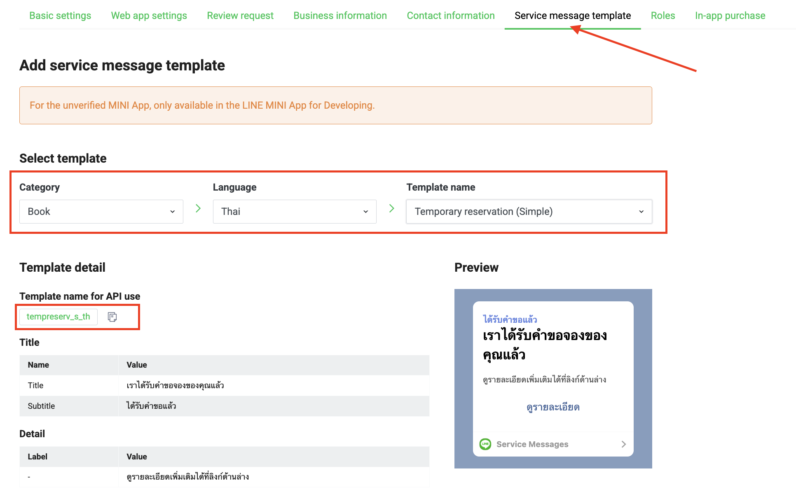

<aside class="positive">
<strong>Tip:</strong> จด **Template name for API use** ไว้ทันที (รูปแบบ <code>{template_name}_th</code>) — จะใช้ใน Prompt และ API ขั้นตอนถัดไป
</aside>

#### ตั้งชื่อ Use case

ระบุชื่อ **Use case** ให้สื่อถึงจุดประสงค์ของ Template (เช่น `Book Confirmed`) แล้วกด **Add**

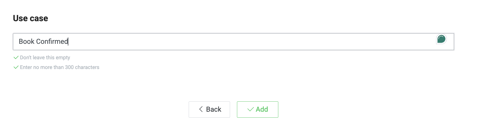

#### ทดสอบส่งข้อความด้วยตัวแปร (Template Variables)

ถัดลงมาในหน้าเดียวกัน เราจะพบกับส่วนของ **ตัวแปร (Template Variables)** ที่จะเอาไว้ใช้กับ API โดยที่เราสามารถทดสอบส่งข้อความได้

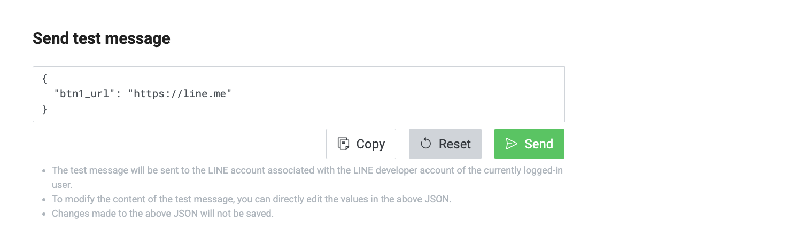

<aside class="negative">
<strong>Important:</strong> การส่งข้อความด้วย Service Messages จะสามารถเลือกประเภทของข้อความได้<strong>ตาม Template ที่ทาง LINE เตรียมไว้ให้เท่านั้น</strong>
</aside>


## Implement Service Message ใน MINI App
Duration: 0:45:00

ในช่วงนี้คุณจะใช้ **Prompt ใน Google AI Studio** เพื่อ Implement การส่ง Service Message หลังจองสำเร็จ

### Prompt สร้าง Backend สำหรับ Service Message API

```
ADD ENV FILE: 
- CHANNEL_ID = YOUR_CHANNEL_ID
- YOUR_CHANNEL_SECRET = CHANNEL_SECRET

Implement a backend server function to send a LINE MINI App Service Message when a reservation is successfully created. We will use the standard template `book_request_s_b_th`.

### Architecture & API Flow Adjustments

#### 1. Frontend Client Modification
- Update the API submission call in `src/api/reservationService.js`. 
- Extract the user's active LIFF Access Token using `liff.getAccessToken()`.
- Send this token to our Express backend via an HTTP request header named `x-liff-access-token`.

#### 2. Express Server (`server.js`) Updates
Add a dedicated helper function or expand the `POST /api/reservations` endpoint to orchestrate the 3-step LINE Service Message workflow:

- **Step A: Issue Stateless Channel Access Token**
  * Endpoint: `POST https://api.line.me/oauth2/v3/token`
  * Content-Type: `application/x-www-form-urlencoded`
  * Body Data: 
    - `grant_type`: `client_credentials`
    - `client_id`: `YOUR_CHANNEL_ID`
    - `client_secret`: `YOUR_CHANNEL_SECRET`

- **Step B: Issue Service Notification Token**
  * Endpoint: `POST https://api.line.me/message/v3/notifier/token`
  * Headers: `Authorization: Bearer <Stateless_Channel_Access_Token>`
  * Body (JSON): `{ "liffAccessToken": "<Token_From_Header>" }`
  * Response contains: `notificationToken`

- **Step C: Send the Service Message**
  * Endpoint: `POST https://api.line.me/message/v3/notifier/send?target=service`
  * Headers: `Authorization: Bearer <Stateless_Channel_Access_Token>`
  * Body (JSON):
    ```json
    {
      "templateName": "book_request_s_b_th",
      "params": {
        "number": "Reservation ID",
        "btn1_url": "See Detail Label",
        "btn2_url": "Read Label",
        "btn3_url": "Edit Label",
        "btn4_url": "Map Label"
      },
      "notificationToken": "<Notification_Token_From_Step_B>"
    }
    ```

---

### Expected Output Structure
Please provide the complete, updated code blocks for:
- `src/api/reservationService.js` (Passing the `x-liff-access-token` header correctly during execution)
- `server.js` (Full Express server including the multi-step external requests to LINE's token and notifier platforms using URLSearchParams for Step A, utilizing `process.env.LINE_CHANNEL_ID` and `process.env.LINE_CHANNEL_SECRET`)
```


### ทดสอบ Service Message
- จองโต๊ะใน MINI App 
- ได้รับ Service Message ผ่าน LINE MINI App Notice


## Congratulations
Duration: 0:05:00

ยินดีด้วยครับ ถึงตรงนี้คุณก็มี LINE MINI App ตัวแรกเป็นของคุณเองแล้ว!!!

### สิ่งที่คุณได้เรียนรู้ใน Codelab นี้

✅ การสร้าง Provider และ LINE MINI App Channel ใน LINE Developers Console  
✅ การสร้างเว็บจองร้านอาหารด้วย Vibe Coding ใน Google AI Studio  
✅ การแปลงเว็บธรรมดาให้กลายเป็น LINE MINI App ด้วย Prompt  
✅ การดึงข้อมูลผู้ใช้งาน LINE (User Profile) ด้วย Prompt  
✅ การแชร์ข้อความไปยังเพื่อนหรือกลุ่มด้วย Share Target Picker ผ่าน Prompt  
✅ การตั้งค่า Service Message Template ใน LINE Developers Console  
✅ การส่ง Service Message ยืนยันการจองด้วย Prompt ใน Google AI Studio  

### เรียนรู้เพิ่มเติม

- [บทความเกี่ยวกับ LINE MINI App ใน LINE Developers Thailand](https://medium.com/linedevth/tagged/line-mini-app)

### Reference docs

- [LINE MINI App Quickstart](https://developers.line.biz/en/docs/line-mini-app/quickstart/)
- [Google AI Studio](https://aistudio.google.com/)
- [LINE MINI App Documentation](https://developers.line.biz/en/docs/line-mini-app/)
- [Sending service messages](https://developers.line.biz/en/docs/line-mini-app/develop/service-messages/)
- [Open MINI App in external browser](https://developers.line.biz/en/docs/line-mini-app/develop/external-browser/)
- [Share Target Picker](https://developers.line.biz/en/docs/liff/sharing-target-picker/)
- [LINE MINI App API Reference](https://developers.line.biz/en/reference/line-mini-app/)

### บอกเราหน่อยว่า Codelab ชุดนี้เป็นอย่างไรบ้าง

- [Feedback form](https://forms.gle/xXkqeFE3vLSubP1f9)
